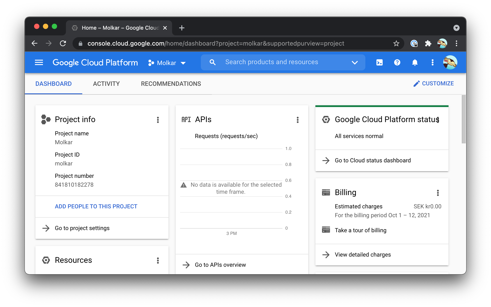
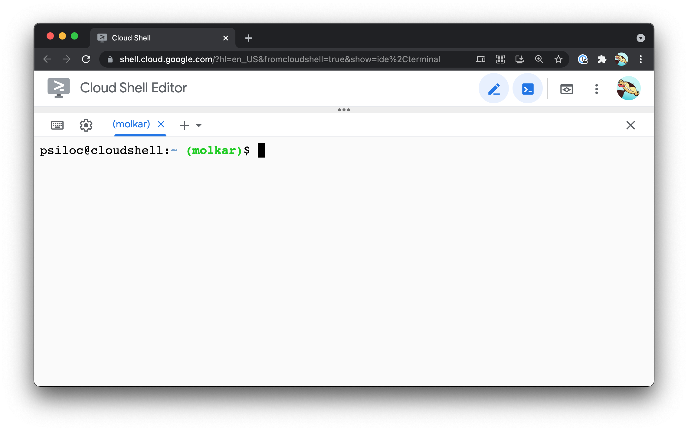
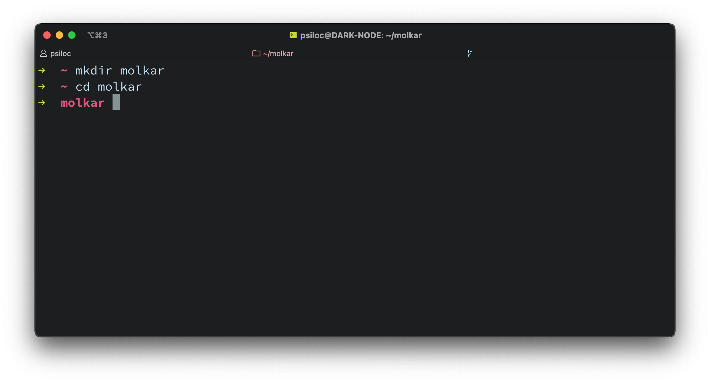

# Google cloud [console.cloud.google.com](console.cloud.google.com)



##Prerequisites

1. A google account (example@gmail.com)
   **Note!** Not a google workspace account

2. Installing Cloud SDK

3. A computer with access to the internet

4. A credit card to enable billing for your projects

5. Patience

## Table of Contents

1. [Run in the cloud](#run-in-the-cloud)
   1.1 [From your web browser (Web)](#web) 

   1.2 [From the command line interface (CLI)](#cli)

## Install the google cloud system developer kit (SDK)

1. Goto [https://cloud.google.com/sdk/docs/install](https://cloud.google.com/sdk/docs/install)

2. Choose the instructions on which OS you are running on. 
   I am using macOS, it is mainly for the SDK, the procedure to run in the cloud is somewhat the same.


## Run a Node.js app the cloud 

It is just another computer =)

In this example
### Web
Goto [console.cloud.google.com](console.cloud.google.com) in your browser

1. **Create** a project [https://console.cloud.google.com/projectcreate](https://console.cloud.google.com/projectcreate)

2. **Enter** a project name, example `Molkar`

3. **Skip** `Location` if you have not got any `Organisations`

4. **Enable API** you need to be able to run the project `Molkar` in the cloud

### CLI
In your favorite terminal, I use iTerm on my localhost/computer. 
Doesn´t matter really, you can even use the cloud shell, [Goto cloud shell](https://shell.cloud.google.com/?hl=en_US&fromcloudshell=true&show=ide%2Cterminal) **Note!** Neeed to be looged into Google cloud console.

Example: CLI as cloud shell


1. Make a directory, e.g `molkar`

   ```sh
   mkdir molkar
   ```

2. Change directory to `molkar`

   ```sh
   cd molkar
   ```

   **Example:**

   

3. Create a `package.json` and add a simple object with these values:
   This will install an app that use a web framework [Express.js](https://expressjs.com/) and is started with `node index.js`. In this example I have set the node version to `14.17.3`

   ```json
   {
    "name": "molkar",
    "description": "Node example app",
    "version": "1.0.0",
    "private": true,
    "main": "index.js",
    "scripts": {
      "start": "node index.js"
    },
    "engines": {
      "node": ">= 14.17.3"
    },
    "author": "Erik Emmerfors",
    "license": "GNU",
    "dependencies": {
      "express": "^4.17.1"
    }
   }
   ```

